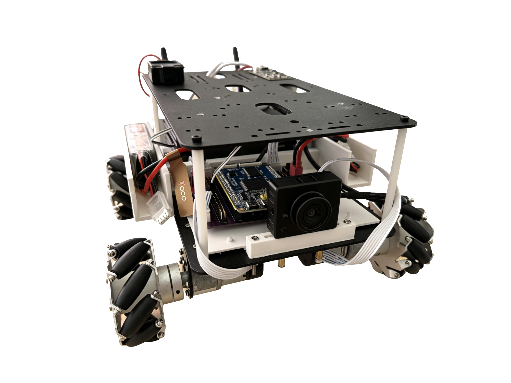
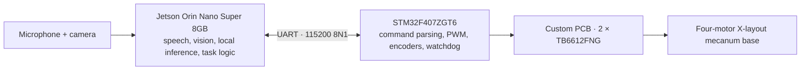

# Embodied Robot Heterogeneous Control

**A hardware-validated Jetson–STM32 wheeled robot, evolving from a bachelor's thesis prototype into a research platform for asynchronous inference and real-time control.**

This repository began with my bachelor's thesis on speech interaction and visual perception for a wheeled robot. The thesis system runs fully local speech and vision pipelines on a Jetson Orin Nano, while an STM32F407 executes motion commands and enforces a communication watchdog. The same platform will now be used to study how long-running perception and inference can coexist with predictable control timing.

> 中文简介：本仓库记录“章鱼号”轮式机器人的本科毕设基线，并在同一平台上继续研究异构计算架构下的异步推理、实时控制与系统评测。当前版本已经完成 Jetson、STM32 和自制底层驱动板的整机验证；Phase 1 已建立有界运行时、可观测 worker、周期探针和模拟实验运行器，完成 Jetson simulation pilot、线程版与进程隔离版固定输入 VLM correctness pilot，并已实现 host-tested 固定输入 ASR 切片；ASR Jetson pilot、LLM 切片、正式对比实验与整机应用适配尚未完成。

## Project status

| Item | Status |
| --- | --- |
| Bachelor's thesis software and firmware | Complete and hardware validated |
| Custom base-driver PCB | Published and tested on the physical robot |
| Jetson–STM32 command link | Validated with ACK/error responses and a 1.2 s command watchdog |
| Asynchronous inference runtime | Bounded executor, probe and replay validated by Jetson simulation and thread/process VLM correctness pilots; fixed-input ASR subprocess slice host-tested, Jetson ASR pilot pending |

The validated Jetson–STM32 code is preserved at [`v0.1.0-thesis-baseline`](https://github.com/yuzhang-robotics/embodied-robot-heterogeneous-control/tree/v0.1.0-thesis-baseline). The current `main` branch also includes the reviewed hardware documentation and editable PCB export.

## System at a glance

| Layer | Baseline implementation |
| --- | --- |
| Speech input | sherpa-onnx keyword spotting and CUDA-enabled whisper.cpp ASR |
| Dialogue | Qwen2.5-1.5B served locally by llama.cpp |
| Scene description | Moondream through Ollama, followed by local Chinese rewriting or Argos translation |
| Speech output | Piper TTS |
| Target approach | OpenCV HSV detection and a discrete visual feedback loop |
| Motion transport | Line-based ASCII commands over 3.3 V TTL UART |
| Low-level execution | STM32F407, 20 kHz motor PWM, 10 ms encoder sampling and command-loss stop |
| Hardware | Custom two-layer base-driver PCB and four MG513P30_12V geared motors |

Model weights and device-specific runtime data are intentionally not stored in Git.

## What has been validated

The baseline has been exercised on the assembled robot rather than only in simulation:

- offline wake word, recording, speech recognition, local dialogue and speech synthesis;
- camera scene description with a local vision-language model;
- voice-triggered color-target approach (red tested end to end; red, blue, green and yellow classes implemented);
- `F/B/L/R/S` chassis commands, with `L/R` defined as in-place rotation;
- STM32 `A` acknowledgment for valid frames and `E` for malformed frames;
- automatic motor stop about 1.2 seconds after valid commands cease;
- four encoder channels, calibrated so forward wheel motion has a consistent sign;
- Keil MDK build, CMSIS-DAP flashing and end-to-end Jetson–STM32 testing on the custom PCB.

The STM32 currently applies open-loop PWM commands. Encoder measurements are available, but closed-loop wheel-speed control and full mecanum kinematics are not part of this thesis baseline.

## From the thesis baseline to the research platform

The current Jetson application is synchronous: wake-word detection, recording, ASR, dialogue or VLM inference, speech output and target tracking run as blocking stages. This is straightforward to reproduce, but inference latency can delay unrelated work and there is no explicit deadline or data-age policy.

Phase 1 now has an immutable task/result model, bounded task ownership, scoped
state generations, a single-worker observable executor, an absolute-schedule
periodic probe, independent lifecycle trace replay and a reproducible
simulated-condition runner. A fail-closed Jetson preflight, continuous
`tegrastats` recorder and pilot-session validator are also implemented. A
motion-disabled Jetson simulation pilot completed all session Gates; its
[descriptive report](experiments/phase1/results/20260828T121142Z_phase1_jetson_pilot/)
separates simulated timing behavior from the additional bounded-runtime
semantics. A fixed-input Moondream/Qwen correctness pilot also completed both
nominal consumption and old-generation rejection. Its
[descriptive report](experiments/phase1/results/20260830T073825Z_phase1_vlm_pilot/)
shows that all skipped releases occurred during lazy module import in the
independent Python probe, so thread-level timing isolation does not generalize
from the simulated sleep workload. A spawned-process VLM adapter now keeps the
broker, freshness checks and periodic probe in the parent process while moving
the lazy adapter path behind bounded IPC. A subsequent
[process-isolated correctness pilot](experiments/phase1/results/20260830T122541Z_phase1_vlm_process_reaping/)
completed both real-model conditions with normally reaped children, zero stale
consumption and no skipped 100 ms probe releases. The earlier thread reference
recorded 148 skipped releases, but this cross-session single-run contrast is a
descriptive mitigation signal rather than a causal comparison. No pilot
authorizes a performance-superiority, hard-real-time or heterogeneous-inference
claim. The next Phase 1D increment reuses the exact Phase 0 fixed WAV and
Whisper identity. Its host-tested ASR slice supervises `whisper-cli` as the
backend process, confirms termination and reaping after state invalidation,
and keeps transcript text out of artifacts. That ASR path has not yet run on
the Jetson and is not formal data. The broader research stage will investigate:

- independent acquisition, inference, planning and control workers;
- timestamped bounded queues, cancellation and stale-result rejection;
- CPU/GPU resource arbitration between ASR, language and vision models;
- a safety supervisor that remains responsive while inference is busy;
- measurements of latency, jitter, control frequency, missed deadlines, memory and power;
- encoder-based feedback and a broader mecanum motion interface after the runtime boundary is stable.

These are research objectives, not claims about the current implementation. The present code and hardware form the reproducible comparison baseline.

## Repository map

| Path | Contents |
| --- | --- |
| [`jetson/`](jetson/) | Speech, vision, local inference, task logic and STM32 communication |
| [`firmware/stm32f407/`](firmware/stm32f407/) | Keil/SPL firmware for motor drive, encoders, protocol handling and safety timeout |
| [`protocol/`](protocol/) | UART frame format, responses and timing contract |
| [`hardware/pcb/`](hardware/pcb/) | Editable EasyEDA Pro export of the custom base-driver PCB |
| [`docs/hardware/`](docs/hardware/) | Physical platform, wiring, pin assignments, power and safety notes |
| [`docs/architecture/`](docs/architecture/) | Current timing model and the boundary of the planned asynchronous architecture |
| [`experiments/phase0/`](experiments/phase0/) | Synchronous fixed-input measurement, validation and formal analysis tools |
| [`experiments/phase1/`](experiments/phase1/) | Host tests, simulation, fixed-input VLM and ASR runners, Jetson pilots, deterministic analysis, trace schemas and validation |

## Reproducing the baseline

Start with the component-specific notes:

1. [Jetson runtime and model services](jetson/README.md)
2. [STM32 firmware build and flashing](firmware/stm32f407/README.md)
3. [UART protocol](protocol/README.md)
4. [Hardware wiring and power safety](docs/hardware/README.md)
5. [Editable PCB source](hardware/pcb/README.md)

Physical motion is disabled by default in the Jetson code. Keep the wheels off the ground during first tests and review the power and UART voltage requirements before enabling motor output.

## License

Original software and documentation are released under the [MIT License](LICENSE). Editable hardware sources under `hardware/` use [CERN-OHL-P-2.0](hardware/LICENSE); see [hardware/NOTICE](hardware/NOTICE). STMicroelectronics and Arm support files retain their own notices, documented in [`firmware/stm32f407/THIRD_PARTY_NOTICES.md`](firmware/stm32f407/THIRD_PARTY_NOTICES.md). Models, datasets and external tools follow their respective licenses.
