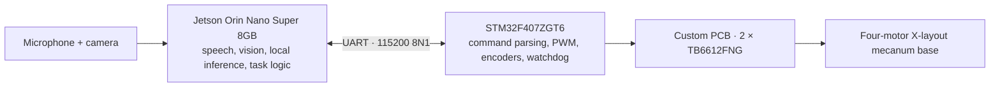

# Embodied Robot Heterogeneous Control

**A hardware-validated Jetson–STM32 robot and reproducible systems research
platform for local inference under control-time constraints.**

This repository began as my bachelor's thesis: a wheeled robot that performs
offline speech interaction, local language and vision inference, target
approach and low-level motion execution. I now use the same physical platform
to study how long-running inference can coexist with responsive control on a
resource-limited edge computer.

> 中文简介：本仓库记录“章鱼号”轮式机器人的本科毕设基线，以及基于同一实物平台开展的
> 后续系统研究。当前重点是 Jetson 上本地 ASR、LLM、VLM 与时限敏感任务之间的运行时
> 隔离、结果时效性和共享资源干扰。

## Current status

| Layer | State |
| --- | --- |
| Thesis robot | Complete and validated on the assembled Jetson–STM32 platform |
| Phase 0 synchronous baseline | Fixed-input measurement, validation and analysis tooling complete |
| Phase 1 bounded-runtime study | Closed; lifecycle, capacity, freshness and real-workload correctness established |
| G6 v4 formal decision | Closed valid negative result; overall success Gate not met |
| Closing mechanism diagnostic | Complete; post-VLM Whisper residency loss isolated under the tested configuration |
| Phase 2 residency-restoration study | P2-D3 correctness-pilot contract and runner prepared and host-tested; no target data collected |

The validated thesis implementation is preserved at
[v0.1.0-thesis-baseline](https://github.com/yuzhang-robotics/embodied-robot-heterogeneous-control/tree/v0.1.0-thesis-baseline).
The [research roadmap](docs/research-roadmap.md) explains how the later studies
build on that baseline.

## System at a glance

| Layer | Validated implementation |
| --- | --- |
| Speech | sherpa-onnx keyword spotting, whisper.cpp ASR and Piper TTS |
| Local reasoning | Qwen2.5-1.5B served by llama.cpp |
| Scene description | Moondream through Ollama with local Chinese rewriting or translation |
| Target approach | OpenCV HSV detection and a discrete visual feedback loop |
| Motion transport | Line-based ASCII commands over 3.3 V TTL UART |
| Low-level execution | STM32F407, 20 kHz PWM, 10 ms encoder sampling and a 1.2 s command watchdog |
| Hardware | Custom two-layer driver PCB and four geared motors |

Model weights and device-specific runtime data are intentionally not stored in
Git.

## Engineering and research contributions

- **Complete physical system.** The Jetson software, STM32 firmware, custom
  PCB, mecanum base and local model services were integrated and tested on the
  assembled robot.
- **Independent safety boundary.** The STM32 validates motion frames, reports
  acknowledgements or errors and stops the motors when valid commands cease.
  Physical motion is disabled by default in the Jetson code.
- **Reproducible measurement path.** Fixed inputs, immutable protocol
  identities, fail-closed preflights, continuous resource telemetry, artifact
  hashes and independent analyzers separate experiment evidence from console
  output.
- **Bounded asynchronous semantics.** The Phase 1 runtime makes task capacity,
  ownership, cancellation, state generations and stale-result rejection
  explicit and independently replayable.

The STM32 baseline currently applies open-loop PWM. Encoder measurements are
available, but closed-loop wheel-speed control and full mecanum kinematics are
outside the validated thesis scope.

## Research outcome

Phase 1 tested whether the bounded asynchronous path could preserve a periodic
software probe while keeping ASR, LLM and VLM workload performance within a
preregistered noninferiority margin. The final G6 v4 collection completed in
full. Every run, lifecycle and responsiveness criterion passed, but none of the
three workloads established the performance margin. The preregistered overall
decision therefore failed, and the application slice was not authorized.

A separate six-session diagnostic then found a repeatable post-VLM loss of
warmed Whisper model-file residency, followed by a slow storage-backed ASR
invocation and immediate recovery. This does not change G6 v4. It motivates
the now-active design stage for a separate
[bounded residency-restoration study](docs/architecture/phase2-residency-restoration-design.md).
Phase 1 is closed: its protocols, results and failed-attempt evidence remain
frozen, and no Phase 1 application integration will be started.

See the [G6 v4 report](experiments/phase1/results/20260907T051448Z_phase1_formal_g6_v4/)
and [carryover report](experiments/phase1/results/20260908T072640Z_phase1_asr_vlm_carryover_v2/)
for the complete results and claim boundaries.

## Repository map

| Path | Contents |
| --- | --- |
| [jetson/](jetson/) | Speech, vision, local inference, task logic and STM32 communication |
| [jetson/phase1_runtime/](jetson/phase1_runtime/) | Hardware-independent bounded runtime kernel |
| [firmware/stm32f407/](firmware/stm32f407/) | Motor drive, encoders, protocol handling and watchdog firmware |
| [protocol/](protocol/) | UART frame format, responses and timing contract |
| [hardware/pcb/](hardware/pcb/) | Editable EasyEDA Pro export of the custom driver PCB |
| [docs/hardware/](docs/hardware/) | Physical platform, wiring, pin assignments, power and safety |
| [docs/architecture/](docs/architecture/) | Current timing domains, research runtime and formal contracts |
| [experiments/](experiments/) | Phase 0/Phase 1 tools and public derived evidence |

## Start here

- To reproduce the robot baseline, read the
  [Jetson runtime](jetson/README.md),
  [STM32 firmware](firmware/stm32f407/README.md),
  [UART protocol](protocol/README.md) and
  [hardware notes](docs/hardware/README.md).
- To understand the research progression, read the
  [research roadmap](docs/research-roadmap.md).
- To review the active Phase 2 design boundary, read the
  [bounded residency-restoration design](docs/architecture/phase2-residency-restoration-design.md).
- To inspect experimental methods and results, start from the
  [experiment index](experiments/README.md).
- To review the current and proposed timing boundaries, see the
  [architecture overview](docs/architecture/README.md).

Keep the wheels off the ground during initial tests and review the power and
UART voltage requirements before enabling motor output.

## Evidence boundary

The repository publishes code, protocols and validated derived results. Raw
audio and images, model text, private paths, service logs and full run archives
remain outside Git. Fixed-input systems measurements are not model-quality
benchmarks, and Linux/Python timing results are not hard-real-time guarantees.

## License

Original software and documentation are released under the [MIT License](LICENSE).
Editable hardware sources under hardware/ use
[CERN-OHL-P-2.0](hardware/LICENSE); see [hardware/NOTICE](hardware/NOTICE).
STMicroelectronics and Arm support files retain their own notices, documented
in [THIRD_PARTY_NOTICES.md](firmware/stm32f407/THIRD_PARTY_NOTICES.md).
Models, datasets and external tools follow their respective licenses.
