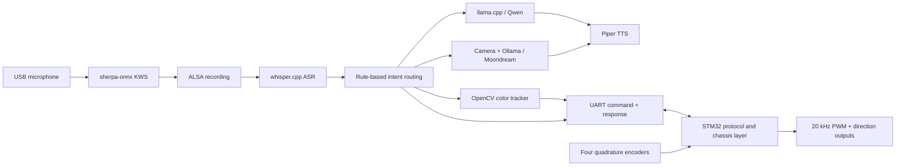
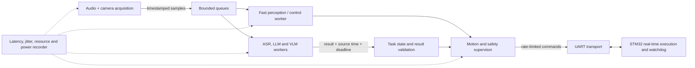

# System Architecture

This page documents the architecture of the hardware-validated thesis baseline and the changes planned for the next research stage. Current behavior and proposed work are kept separate so that later measurements can be compared with the tagged baseline.

> 中文简介：本页说明“章鱼号”当前同步运行链路的时序边界、已知限制，以及下一阶段异步推理与实时控制研究的架构设想。前半部分描述已经验证的现状，后半部分是尚待实现和评测的研究计划。

## Current synchronous baseline

The Jetson application is a single Python process. It moves through wake-word detection, recording, ASR and one selected task before returning to the wake-word loop.

Dialogue and vision-language inference run in local services, but calls from the application are blocking. Moondream is stopped after a scene-description request so that its unified-memory allocation can be reclaimed before later work. The color-target routine also blocks the speech loop until it arrives, times out or fails.

The STM32 runs independently of Jetson inference. Its main loop polls USART3, while a TIM13 interrupt samples encoders and advances the command watchdog every 10 ms. Motor PWM is generated in hardware by TIM8.

## Timing domains

| Domain | Baseline timing | Role |
| --- | --- | --- |
| Jetson conversation pipeline | event-driven and blocking | KWS, recording, ASR, dialogue/VLM and TTS |
| Jetson color controller | nominal 100 ms loop | target detection and discrete motion decision |
| Jetson command refresh | at most 300 ms between unchanged commands | keep the STM32 watchdog alive during tracking |
| STM32 periodic interrupt | 10 ms | encoder update, heartbeat and watchdog tick |
| STM32 command timeout | about 1.2 s | stop motors after loss of valid commands |
| Motor PWM | 20 kHz | four TB6612FNG drive channels |

These values are configuration targets, not a claim of measured worst-case timing on the Jetson. The Python loop can be delayed by camera I/O, operating-system scheduling and serial response waits.

## Data and control boundaries

| Boundary | Owner | Current contract |
| --- | --- | --- |
| Raw audio and camera frames | Jetson process | consumed synchronously; runtime files remain local |
| Model state and requests | llama.cpp / Ollama / whisper.cpp | process or HTTP interfaces managed outside the application |
| Motion decision | Jetson | one of `forward`, `backward`, `turn_left`, `turn_right`, `search`, `stop` |
| Motion frame validation | STM32 | strict `<direction>,<speed>\n` parser with `A/E` response |
| Motor stop on communication loss | STM32 | independent 1.2 s valid-command watchdog |
| Encoder samples | STM32 | calculated every 10 ms but not yet used for closed-loop PWM |

The UART protocol is documented separately in [`protocol/README.md`](../../protocol/README.md).

## Baseline limitations

The synchronous design was sufficient for the thesis demonstration, but it leaves several problems for the next stage:

- a slow model request blocks new speech interaction and other high-level work;
- captured data and inference results do not carry timestamps or validity deadlines;
- there is no bounded queue, backpressure, cancellation or stale-result policy;
- local model services compete for CPU, GPU and unified memory without a scheduler;
- control-loop jitter and end-to-end command latency are printed informally rather than recorded as experiment data;
- encoder feedback is observed but is not part of the motor control law;
- safety is split between explicit Jetson stop commands, a software motion-enable flag and the STM32 timeout, without a unified supervisor state machine.

## Planned asynchronous architecture

The next implementation will preserve the STM32 safety boundary while separating Jetson work by timing requirement.

The first experiments will address these questions:

1. How much do separate workers and bounded queues reduce control jitter while ASR, LLM or VLM inference is active?
2. When should an inference result be cancelled or rejected because its source observation is stale?
3. Which CPU/GPU scheduling and model-residency policy gives the best latency–memory–power trade-off on an 8 GB Jetson?
4. Which safety actions must remain on the STM32, and which supervisory states belong on the Jetson?
5. How does encoder feedback change approach accuracy and stopping repeatability compared with the open-loop thesis baseline?

The proposed task model, lifecycle invariants, queue policies, cancellation
semantics, and Phase 1 safety Gates are specified in the
[Phase 1 runtime contract](phase1-runtime-contract.md). That document is a
design and correctness boundary. The host-only model, bounded broker,
observable worker, periodic probe, lifecycle replay and simulated-condition
runner are implemented. The Jetson preflight, continuous resource sampler and
pilot-session validator have also completed one motion-disabled simulation
pilot on the Jetson. The independently reconstructed
[descriptive result](../../experiments/phase1/results/20260828T121142Z_phase1_jetson_pilot/)
validates the evidence chain and runtime semantics, but it is not a real-model
or formal performance result. The fixed-input VLM adapter has since completed
one nominal/stale correctness pilot on the Jetson. Its independently derived
[report](../../experiments/phase1/results/20260830T073825Z_phase1_vlm_pilot/)
confirms stale-result rejection while also recording module-import-scale gaps
in the threaded periodic probe. The next implementation moves the VLM adapter
call into a spawned child process while the broker, freshness authority and
periodic probe remain in the parent. This path is host-tested but has not yet
been evaluated on the Jetson, so timing isolation is still not claimed.

## Evaluation plan

Future experiments should record at least:

- sensor capture time, inference start/end time and result age at consumption;
- control-loop period, jitter, deadline misses and UART round-trip time;
- command refresh gaps and watchdog-triggered stops;
- CPU, GPU and unified-memory usage by workload;
- end-to-end task latency and target-approach success/stopping error;
- power consumption where the available instrumentation permits it.

The tagged thesis code remains the comparison point. Scheduling and communication changes will be introduced incrementally. Physical motion will remain disabled by default, and the existing UART and watchdog tests will be repeated whenever either boundary changes.
