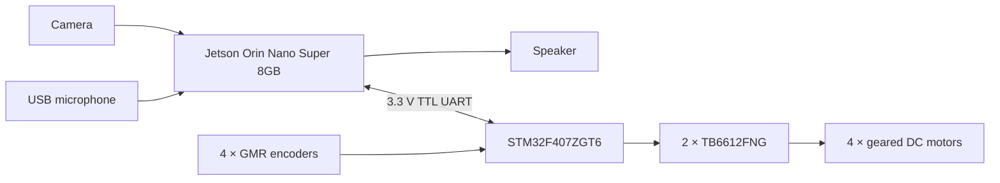

# Robot Hardware Platform

This page describes the physical platform used for the bachelor's thesis baseline: a Jetson Orin Nano computer, an STM32F407 controller, a custom base-driver PCB and a four-motor mecanum chassis. The specifications and wiring below reflect the assembled robot that was built, flashed and tested.

> 中文简介：本页记录“章鱼号”轮式机器人的实物组成、接口定义、供电边界、安全注意事项和实机验证结果。仓库中的图片、固件和 PCB 工程共同描述已经验证的本科毕设平台；毕业论文原稿继续保留在本地。


## Baseline configuration

| Component | Tested configuration | Responsibility |
| --- | --- | --- |
| High-level computer | Jetson Orin Nano Super 8GB, Ubuntu 22.04 | speech, vision, local inference and task decisions |
| Low-level controller | ALIENTEK STM32F407ZGT6 minimum-system board | protocol parsing, motor output, encoder acquisition and command watchdog |
| Base-driver board | custom EasyEDA Pro PCB | module interconnection, power distribution, UART and two TB6612FNG drivers |
| Motors | 4 × MG513P30_12V, 30:1 gearbox, GMR encoder | four independently driven wheels |
| Wheels | four mecanum wheels in X configuration | forward/backward motion and in-place rotation in the current baseline |
| Peripherals | camera, USB microphone and speaker | visual and speech interaction |
| Batteries | 2 × Gens ace 3S 2200 mAh LiPo packs | independent Jetson and chassis supply paths |
| Debug interface | CMSIS-DAP | STM32 flashing and online debugging |

The exact camera, microphone and speaker models were not recorded during the thesis build. They are therefore treated as platform-specific peripherals rather than claimed reproduction specifications.

## Functional layout



The following diagram was prepared during the thesis and shows the same high-level partition: perception and decisions run on the Jetson, while command execution and encoder acquisition remain on the STM32.


The current STM32 firmware samples encoder data but does not feed it back into motor PWM. “Real-time control” in the thesis diagram therefore refers to deterministic command execution, PWM generation, sampling and safety timeout—not closed-loop wheel-speed control.

## Chassis convention

Viewed from above with the robot facing forward, wheel identifiers are:

```text
                  FRONT
            LF \         / RF

            LB /         \ RB
```

| Identifier | Position |
| --- | --- |
| `LF` | left front |
| `RF` | right front |
| `LB` | left rear |
| `RB` | right rear |

The mecanum rollers form an X layout. The thesis protocol only uses forward, backward and in-place rotation: `L/R` mean rotate left/right, not lateral translation. Sideways motion and full mecanum kinematics are reserved for a later control revision.

## Jetson-to-STM32 UART link

The two controllers communicate at 115200 baud, 8 data bits, no parity and one stop bit. The electrical interface is 3.3 V TTL.

| Jetson 40-pin header | Direction | STM32F407 | Function |
| --- | --- | --- | --- |
| Pin 8, UART1 TX | Jetson → STM32 | PB11, USART3 RX | motion command |
| Pin 10, UART1 RX | STM32 → Jetson | PB10, USART3 TX | `A/E` response |
| GND | common reference | GND | signal ground |

The Jetson device is `/dev/ttyTHS1`. TX and RX must be crossed, and the Jetson and chassis supplies must share a reliable signal ground. Do not connect 5 V TTL or RS-232 levels directly to the Jetson GPIO header.


The line protocol and timeout contract are documented in [`protocol/README.md`](../../protocol/README.md).

## STM32 pin allocation

### Motor output

TIM8 produces four 20 kHz PWM channels. Direction pins drive the two inputs of each TB6612FNG channel.

| Wheel | PWM output | Direction inputs |
| --- | --- | --- |
| LF | PC6 / TIM8 CH1 | PG6, PG7 |
| RF | PC7 / TIM8 CH2 | PC0, PC1 |
| LB | PC8 / TIM8 CH3 | PC2, PC3 |
| RB | PC9 / TIM8 CH4 | PC4, PC5 |

TB6612 standby is tied high on the carrier PCB. The firmware therefore configures every PWM and direction pin as a low GPIO output before enabling alternate functions and timers. This initialization order prevents a short uncontrolled pulse during startup.

### Encoder input

| Wheel | Timer | Quadrature inputs |
| --- | --- | --- |
| LF | TIM4 CH1/CH2 | PB6, PB7 |
| RF | TIM3 CH1/CH2 | PA6, PA7 |
| LB | TIM2 CH1/CH2 | PA5, PA1 |
| RB | TIM1 CH1/CH2 | PE9, PE11 |

TIM13 triggers the four-channel encoder update every 10 ms. The firmware configuration uses 500 encoder lines, quadrature ×4, a 30:1 gearbox and a measured wheel circumference of 0.235619 m. Direction signs were calibrated during an off-ground forward test.

Encoder totals, increments, rpm and linear-speed estimates are available in firmware, but the motor command remains an open-loop speed-percentage-to-PWM mapping.

### Status and safety resources

- PF9 and PF10 drive the two LEDs used for heartbeat and command indication.
- USART3 is reserved for Jetson motion frames and short `A/E` responses.
- TIM13 supplies the 10 ms sampling tick and advances the communication watchdog.
- If no valid motion frame arrives for approximately 1.2 seconds, all four motor outputs are stopped.

## Motor and encoder data

The following values come from the MG513P30_12V motor information used during component selection.

| Parameter | Value |
| --- | --- |
| Rated voltage | 12 V |
| Gear ratio | 30:1 |
| Rated current | 0.36 A |
| Stall current | 3.2 A |
| No-load speed after gearbox | 366 ± 26 rpm |
| Rated speed after gearbox | 293 ± 21 rpm |
| Rated torque | 1 kg·cm |
| Stall torque | 4.5 kg·cm |
| Rated power | approximately 4 W |
| Encoder | 500 ppr GMR incremental encoder, A/B outputs |
| Encoder supply | 3.3-5 V, outputs with pull-ups |

The motor information recommends 11-16 V, with 12 V as the preferred point. The 3.2 A stall current must not be treated as a sustainable operating current. It reaches the published peak-current region of the TB6612FNG and exceeds its continuous per-channel capability, so mechanical stalls must be avoided and a later PCB revision should add explicit current and fault protection.

## Custom base-driver PCB

The custom board carries two TB6612FNG devices, each driving two motors. Four six-pin connectors combine motor and GMR encoder wiring for LF, RF, LB and RB. The board also breaks out the STM32 minimum-system module, Jetson UART, battery inputs, power switches and local voltage rails.


The editable EasyEDA Pro interchange package is available at [`hardware/pcb/easyeda-pro/octopus-base-driver-v1.0.epro2`](../../hardware/pcb/easyeda-pro/octopus-base-driver-v1.0.epro2). It has been re-imported successfully with EasyEDA Pro V3.2.135, and its SHA-256 is:

```text
e70d9601b270a4069da39514ad9967569b05c352323df8cc548aded1b6ffcbae
```

The export is useful for inspection and editing, but it is not a ready-to-order manufacturing release. The original `.eprj2` database, Gerber files, BOM, placement file and purchase records are not published. Re-run ERC/DRC and review footprints, clearances and available components before producing another board.

Import instructions and hardware licensing are in [`hardware/pcb/README.md`](../../hardware/pcb/README.md).

## Power architecture

The robot uses two separate 3S 2200 mAh LiPo packs. A 3S pack is nominally 11.1 V and reaches 12.6 V when fully charged.

### Jetson supply path

- One pack is dedicated to the Jetson through the PCB `SW1/CN1` path.
- The Jetson barrel connector is center-positive.
- The exact plug dimensions and cable gauge were not recorded and must be checked on the physical system before replacement.

### Chassis supply path

- The second pack enters the chassis `VCC` rail through `SW2`.
- `VCC` feeds the motor-supply input of both TB6612FNG devices.
- AMS1117-5.0 and AMS1117-3.3 regulators derive the local 5 V and 3.3 V rails.
- These rails supply status indication, the STM32 minimum-system board, GMR encoder electronics and TB6612 logic/enable connections.
- The schematic net name `+12V` denotes the variable 3S battery rail, not a regulated 12.0 V source.

Although the battery paths are separate, the Jetson and chassis must share ground through the UART interface.

## Electrical and first-power-on safety

This PCB was sufficient for the thesis prototype, but its protection boundary must be understood before reuse:

- the board does not integrate a fuse, battery undervoltage cutoff/alarm, TVS suppression or a dedicated current monitor;
- AMS1117 devices are linear regulators, so dissipation and temperature must be checked when dropping as much as 12.6 V to 5 V or 3.3 V;
- the 3S full-charge voltage is close to the upper end of the intended TB6612 motor-supply range, and motor regeneration or wiring inductance can add transient voltage;
- motor stall current is too high for continuous operation through the selected driver;
- safe charging, pack storage and low-voltage protection must be provided externally.

For first power-on or firmware changes:

1. raise all four wheels clear of the floor;
2. keep the PCB power switch within reach;
3. flash the STM32 and confirm that the wheels remain stopped before connecting Jetson motion output;
4. test `S,0`, an invalid frame and the command watchdog before testing directional commands;
5. verify each wheel direction at low duty cycle before placing the robot on the floor.

The software motion-enable flag and STM32 timeout are useful safeguards, but they do not replace a physical power disconnect or electrical protection.

## Hardware validation record

The reviewed thesis platform has completed the following tests on the assembled robot:

- Keil MDK V5.35 / ARM Compiler 5.06 update 7 full rebuild: 0 errors, 0 warnings;
- CMSIS-DAP flashing, followed by a stationary startup check;
- all four encoder channels active, with forward count signs calibrated;
- `F/B/L/R/S` direction tests through the custom PCB;
- valid frames acknowledged with `A`, while `X,99` returned `E` without motion;
- automatic stop approximately 1.2 seconds after the command stream ceased;
- default Jetson safe mode produced no serial activity or wheel movement;
- full local speech, scene-description and red-target approach sequence with acknowledged STM32 commands;
- final stopping decision and wheel motion matched the intended control logic.

The recurring PyTorch/ONNX Runtime GPU-discovery warnings in the tested Jetson environment did not block these functions. They are recorded as a software-environment issue for the next research stage rather than a hardware validation failure.

## Reproduction gaps

The following information or artifacts should be measured or published before treating the platform as fully reproducible:

- exact camera, USB microphone and speaker models;
- Jetson barrel-plug dimensions, power-cable gauge and connector current rating;
- measured Jetson and chassis current under representative workloads;
- 5 V/3.3 V regulator temperature at maximum expected load;
- board revision marking and a connector/silkscreen map;
- reviewed Gerber, BOM and placement outputs for manufacturing;
- quantitative current, transient-voltage and battery-discharge protection tests.

These items define the remaining hardware documentation and measurement work as the repository develops into a reproducible research platform.
