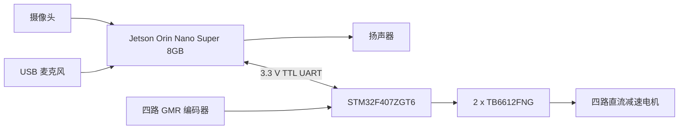
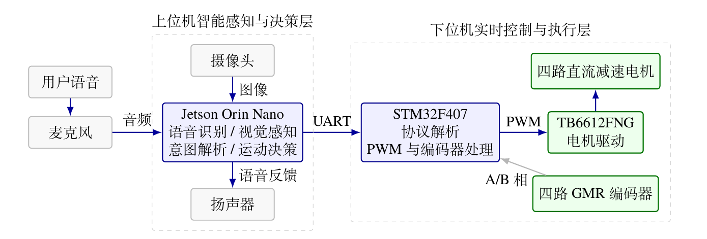
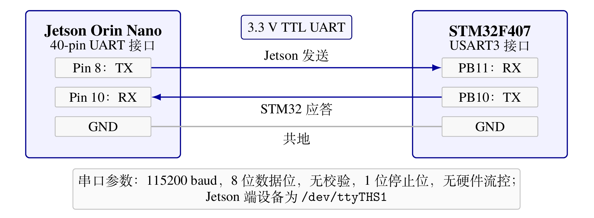
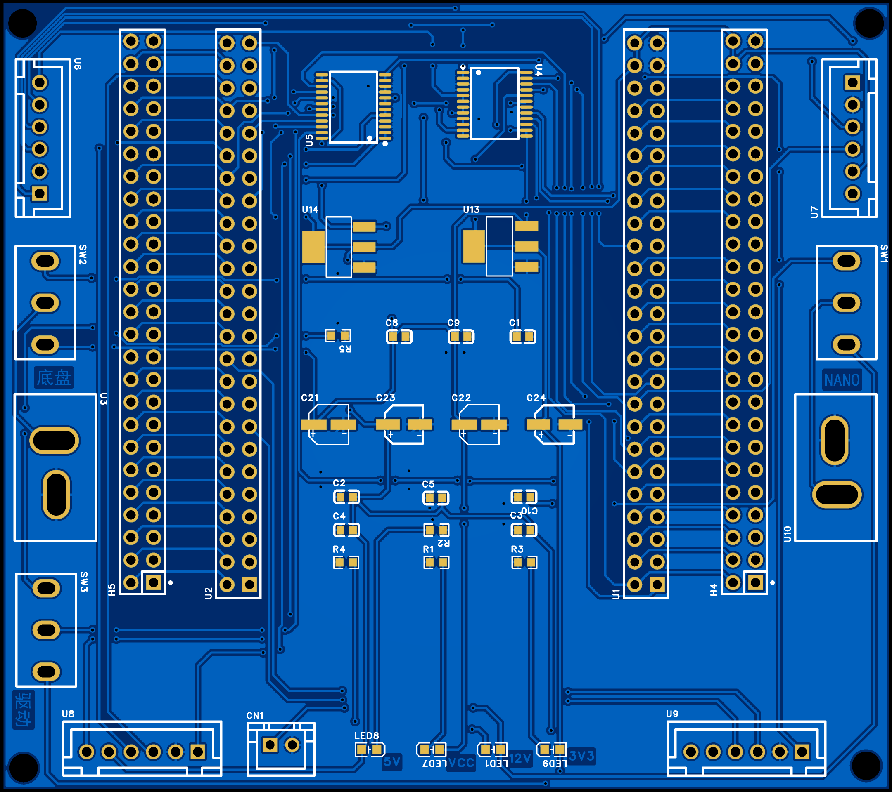
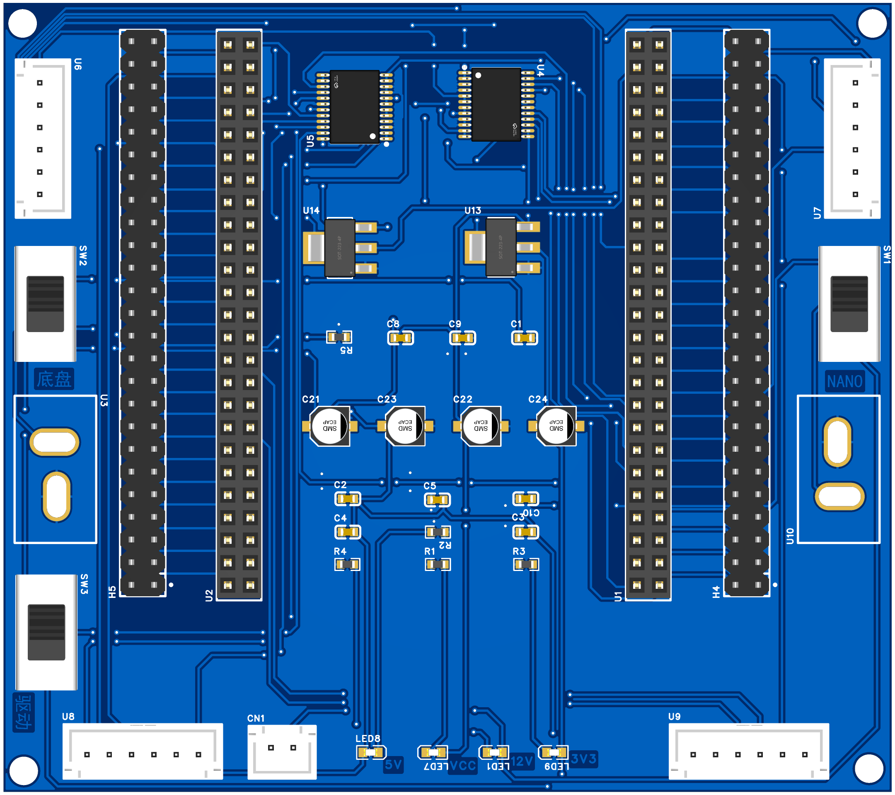

# Hardware Baseline

本文档记录 `v0.1.0-thesis-baseline` 对应的机器人硬件组成、接口关系和已验证配置。
本科毕业论文仅作为本地核对资料，不包含在仓库中。


## 系统组成

- Jetson Orin Nano Super 8GB，运行 Ubuntu 22.04，负责语音、视觉、模型推理和任务决策。
- 正点原子 STM32F407ZGT6 最小系统板，负责电机驱动、编码器采集、运动执行和安全保护。
- 自制底层驱动 PCB，连接 STM32、Jetson、电机、编码器、电源和两片 TB6612FNG。
- 四个 MG513P30_12V 直流减速电机，减速比为 1:30，并带 GMR 增量式编码器。
- 四个按 X 型安装的麦克纳姆轮。
- 摄像头、USB 麦克风和扬声器。
- 两块相互独立的格氏（Gens ace）3S 2200 mAh 锂聚合物电池，分别为 Jetson 和底盘供电。
- CMSIS-DAP 调试器，用于 STM32 下载和在线调试。



论文阶段绘制的系统总体结构如下。该图用于说明硬件模块关系，具体软件结构以后续异构计算
架构文档为准。



## 底盘与车轮约定

从机器人正上方观察，车头朝前，四个轮子编号如下：

```text
              车头
        LF \         / RF

        LB /         \ RB
```

- `LF`：左前轮；`RF`：右前轮；`LB`：左后轮；`RB`：右后轮。
- 麦克纳姆轮采用 X 型安装。
- 当前协议中的 `L/R` 表示原地左转和原地右转，不表示横向平移。
- 当前基线尚未实现横移指令和完整麦克纳姆轮运动学。

## Jetson 与 STM32 串口连接

两端使用 3.3 V TTL 电平、115200 波特率、8 数据位、无校验、1 停止位。

| Jetson 40-pin 接口 | 信号方向 | STM32F407 | 作用 |
| --- | --- | --- | --- |
| Pin 8，UART1 TX | Jetson -> STM32 | PB11，USART3 RX | 发送运动命令 |
| Pin 10，UART1 RX | STM32 -> Jetson | PB10，USART3 TX | 返回 `A/E` 应答 |
| GND | 双向共地 | GND | 信号参考地 |

Jetson 端设备名为 `/dev/ttyTHS1`。TX 与 RX 必须交叉连接并可靠共地；不得将
5 V TTL 或 RS-232 电平直接连接到 Jetson GPIO。



## STM32 外设与引脚分配

### 电机控制

| 车轮 | PWM | 方向输入 |
| --- | --- | --- |
| LF | PC6 / TIM8 CH1 | PG6、PG7 |
| RF | PC7 / TIM8 CH2 | PC0、PC1 |
| LB | PC8 / TIM8 CH3 | PC2、PC3 |
| RB | PC9 / TIM8 CH4 | PC4、PC5 |

四路 PWM 频率为 20 kHz。两片 TB6612FNG 各驱动两路电机。固件在启动早期先将
PWM 和方向控制引脚置为安全低电平，再初始化其他外设，避免上电误动作。

### 电机参数

| 参数 | MG513P30_12V |
| --- | --- |
| 额定电压 | 12 V |
| 减速比 | 1:30 |
| 额定电流 | 0.36 A |
| 堵转电流 | 3.2 A |
| 减速后空载转速 | 366 ± 26 rpm |
| 减速后额定转速 | 293 ± 21 rpm |
| 额定转矩 | 1 kg·cm |
| 堵转转矩 | 4.5 kg·cm |
| 额定功率 | 约 4 W |

电机资料建议 11–16 V 供电，12 V 为最佳工作点。堵转电流 3.2 A 不能作为持续工作电流；
底盘运行时应避免车轮长时间堵转。

### 编码器采集

| 车轮 | 定时器 | A/B 相引脚 |
| --- | --- | --- |
| LF | TIM4 CH1/CH2 | PB6、PB7 |
| RF | TIM3 CH1/CH2 | PA6、PA7 |
| LB | TIM2 CH1/CH2 | PA5、PA1 |
| RB | TIM1 CH1/CH2 | PE9、PE11 |

TIM13 每 10 ms 更新一次四路编码器数据。当前配置按编码器 500 线、30:1 减速比、
四倍频计数和约 0.235619 m 轮周长计算转速与线速度。编码器方向符号已经过架空
前进测试校准。

GMR 编码器分辨率为 500 ppr，采用霍尔磁阻效应，工作电压为 3.3–5 V，输出端带上拉。

### 其他资源

- PF9、PF10：板载 LED，用于命令接收和调试状态指示。
- USART3：Jetson 与 STM32 的控制通信。
- TIM13：编码器采样和 1.2 s 通信看门狗计时。

## 自制底层驱动 PCB

PCB 使用两片 TB6612FNG，每片负责两路直流电机。四组 6-pin 接口分别连接左前、
右前、左后和右后电机及其 GMR 编码器。板上还完成 STM32 最小系统板引脚转接、
Jetson UART 连接、电源分配和电源开关控制。





PCB 使用嘉立创 EDA 专业版设计。仓库提供经过隐私检查和重新导入验证的
[可编辑 `.epro2` 工程](../../hardware/pcb/easyeda-pro/octopus-base-driver-v1.0.epro2)；原始
`.eprj2` 项目数据库不作为公开发布文件。截图和渲染图仅用于理解设计，不能替代制造文件。

## 电源与上电安全

- 自制 PCB 带独立电源开关，并承担电机驱动、电源分配和接口转接。
- 两块电池均为格氏 3S 2200 mAh 锂聚合物电池，标称电压 11.1 V，满电电压 12.6 V。
- 第一块电池经过 PCB 上的 `SW1/CN1` 专门为 Jetson 供电，接入 Jetson 圆形 DC 电源接口，
  中心为正极。
- 第二块电池经过 `SW2` 接入底盘 `VCC`。`VCC` 直接连接两片 TB6612FNG 的电机电源输入，
  同时通过板载 AMS1117-5.0 和 AMS1117-3.3 生成 5 V 与 3.3 V 电源轨。
- 5 V 与 3.3 V 电源轨用于电源状态指示、STM32 最小系统板、GMR 编码器以及
  TB6612FNG 的逻辑电源和使能控制。
- 两套独立电源系统仍需通过 Jetson 与底盘通信接口可靠共地。
- 调试和首次上电时应将四个车轮架空，并确保可以立即切断 PCB 电源。
- STM32 上电后默认停止；连续约 1.2 s 未收到有效命令时自动停止四路电机。
- 原理图网络名 `+12V` 表示 3S 电池供电轨，并非恒定 12 V；选型与安全评估应按
  12.6 V 满电电压考虑。

### 当前硬件边界

- 当前 PCB 未集成保险丝、锂电池低压截止/报警、TVS 浪涌抑制和额外的大容量母线电容。
  使用时应通过外部措施完成过流和低压保护，并使用平衡充电器安全充电。
- AMS1117-5.0 和 AMS1117-3.3 为线性稳压器。由最高 12.6 V 输入降压时应控制负载电流并
  检查器件温升，不能将其作为大电流 5 V/3.3 V 电源使用。
- 3S 电池满电电压接近 TB6612FNG 电机电源的工作上限，应避免堵转，并关注电机回生和
  供电尖峰。后续硬件版本应评估保险丝、低压监测、TVS 和更充分的母线去耦。

## 已验证状态

`v0.1.0-thesis-baseline` 已完成以下实物测试：

- Keil MDK V5.35 / ARMCC 5.06u7 全量编译：0 errors，0 warnings。
- `F/B/L/R/S` 指令、四轮方向和 `A` 应答正常。
- 非法指令返回 `E`，底盘保持静止。
- 停止发送命令约 1.2 s 后，底盘自动停车。
- 四路编码器均有反馈，前进方向计数符号已统一。
- Jetson 语音、视觉目标检测、运动决策与 STM32 底盘形成完整闭环。

## 待补充信息

- Jetson DC 电源插头尺寸及供电线材规格。
- 5 V、3.3 V 电源轨的实际工作电流和稳压器温升。
- 摄像头、USB 麦克风和扬声器的具体型号。
- 自制 PCB 的版本号、接口丝印图，以及用于复现制造的 Gerber、BOM 和坐标文件。
